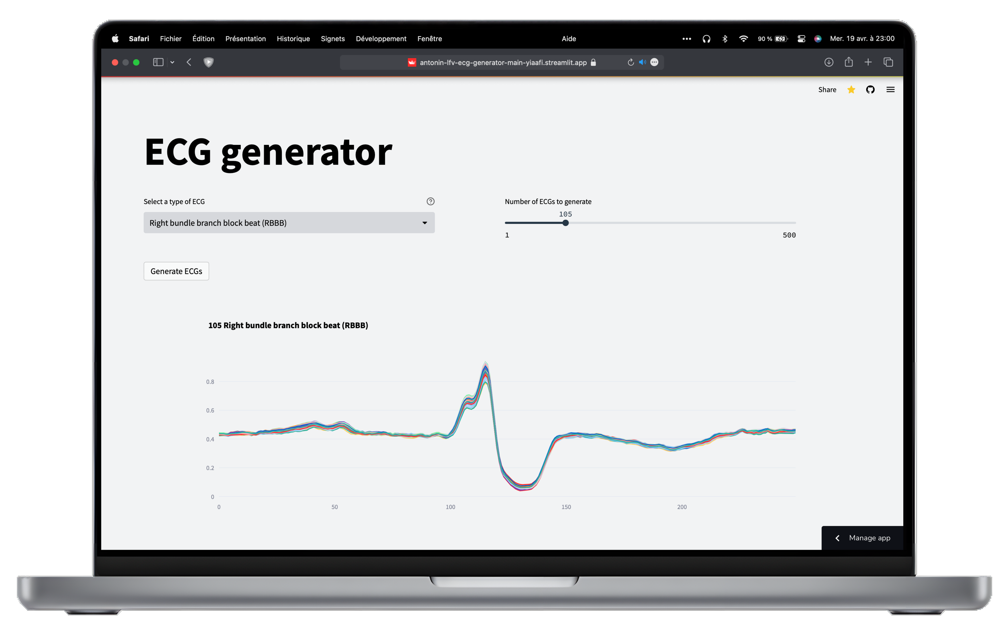

<!-- PROJECT LOGO -->
 

  

  <h3 align="center">ECG Generator</h3>

  

    An awesome streamlit app to generate ECGs!
     
    <a href="https://antonin-lfv-ecg-generator-main-yiaafi.streamlit.app/">Open application</a>
    ·
    <a href="https://github.com/antonin-lfv/ECG_Generator/issues">Report Bug</a>
    ·
    <a href="https://github.com/antonin-lfv/ECG_Generator/issues">Request Feature</a>
  

 

## About The Project

This application is a streamlit app that allows you to generate ECGs. 
It is based on a variational autoencoder where the architecture is detailed [HERE.](https://medium.com/@antoninlefevre45/auto-encodeur-variationnel-pour-la-génération-délectrocardiogrammes-45406e8b98ea)

  

 

In this application, you are able to generate ECGs of different types:
- **NOR** :  Normal beat (NOR)
- **LBBB** :  Left bundle branch block beat (LBBB)
- **RBBB** :  Right bundle branch block beat (RBBB)
- **NE** :  Nodal (junctional) escape beat (NE) 
- **AP** :  Atrial premature beat (AB) 
- **aAP** :  Aberrated atrial premature beat (aAP) 
- **NP** :  Nodal (junctional) premature beat (NP) 
- **PVC** :  Premature ventricular contraction (PVC) 
- **VE** :  Ventricular escape beat (VE) 
- **fVN** :  Fusion of ventricular and normal beat (VF) 

And export them in a csv file. You can choose the number of ECGs you want to generate.
